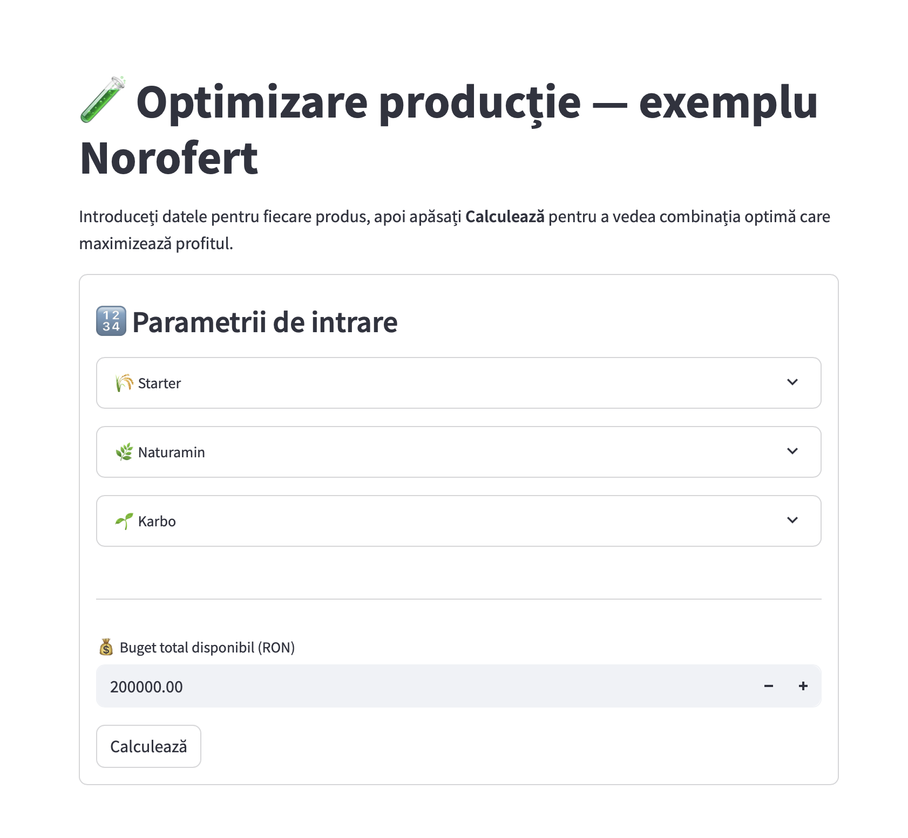

# 🧪 Optimizare producție — exemplu Norofert

Această aplicație este un demo interactiv care arată cum pot fi folosite
metodele de **optimizare liniară** pentru a lua decizii mai bune în producție.

Exemplul pornește de la un scenariu realist din agricultură, cu 3 produse
inspirate din portofoliul Norofert:

- 🌾 Starter
- 🌿 Naturamin
- 🌱 Karbo

---

## 🎯 Ce face aplicația

Pentru fiecare produs, introduci:
- costul de producție
- profitul net estimat per unitate
- cererea minimă de la distribuitori
- capacitatea maximă de producție

Apoi setezi bugetul total disponibil.
Aplicația calculează combinația de produse care **maximizează profitul total**,
respectând toate constrângerile.



---

## 🧠 Tehnologie folosită

- Python
- Streamlit (interfață)
- `scipy.optimize.linprog` (optimizare liniară)

---

## ⚙️ Cum o pornești local

1. Instalează dependențele:
```bash
poetry install
```

2. Rulează aplicația:
```bash
poetry shell
streamlit run app.py
```

---

## 📌 Notă

Toate datele sunt estimative și folosite în scop demonstrativ.
Modelul poate fi adaptat ușor pentru alte industrii sau decizii similare.

---

© 2025 Lucian Ursu
